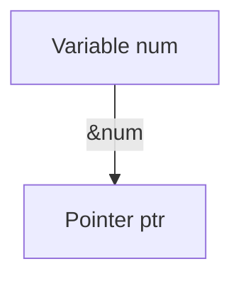
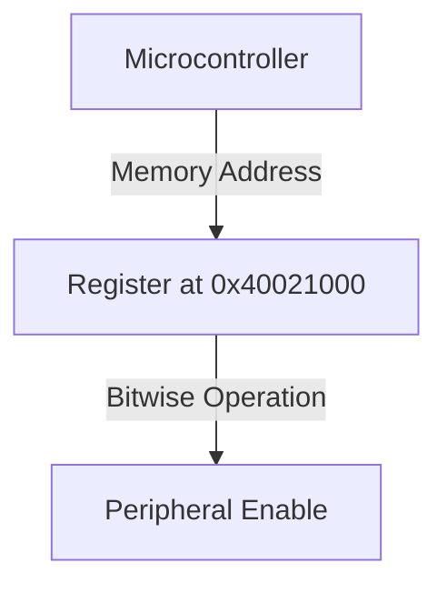

```markdown
# * and & in Relation to Pointer Variable in C

## Introduction
The `*` (asterisk) and `&` (ampersand) operators are fundamental in working with pointer variables in C. Understanding their relationship is crucial for effective memory management and low-level programming.

## Understanding `&` (Address-of Operator)
The `&` operator is used to obtain the memory address of a variable.

```c
int num = 10;
int *ptr = &num; // &num gives the address of num
```

### Memory Representation


## Understanding `*` (Dereference Operator)
The `*` operator is used to access the value stored at the memory address held by a pointer.

```c
printf("Value of num: %d", *ptr); // Dereferencing ptr gives value of num
```

### Pointer Dereferencing Representation
```mermaid
graph TD
    A[Pointer ptr] -->|Dereference (*)| B[Value of num]
```

## Relationship Between `*` and `&`
1. The `&` operator gives the address of a variable.
2. The `*` operator accesses the value at a memory address.

```c
int num = 10;
int *ptr = &num;
printf("Address of num: %p", &num);
printf("Pointer Address: %p", ptr);
printf("Value at Address: %d", *ptr);
```

### Memory Flow
```mermaid
graph TD
    A[Variable num] -->|&num| B[Pointer ptr]
    B -->|Dereference (*)| C[Value of num]
```

## Pointers to Pointers
A pointer can store the address of another pointer, forming a multi-level pointer system.

```c
int **ptr2 = &ptr;
printf("Value using ptr2: %d", **ptr2);
```

### Double Pointer Representation
```mermaid
graph TD
    A[Variable num] -->|&num| B[Pointer ptr]
    B -->|&ptr| C[Double Pointer ptr2]
    C -->|Dereference (**)| A
```

## Application in Embedded Systems
Pointers and memory access are essential in embedded C programming.

```c
#define REG_ADDR (*(volatile unsigned int*) 0x40021000)

void enablePeripheral() {
    REG_ADDR |= (1 << 3); // Enable a specific peripheral
}
```

### Embedded Memory Mapping


Understanding `*` and `&` in relation to pointer variables is critical for efficient memory management in C programming.
```
