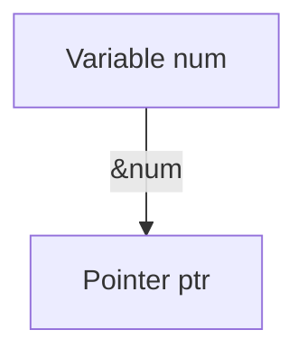
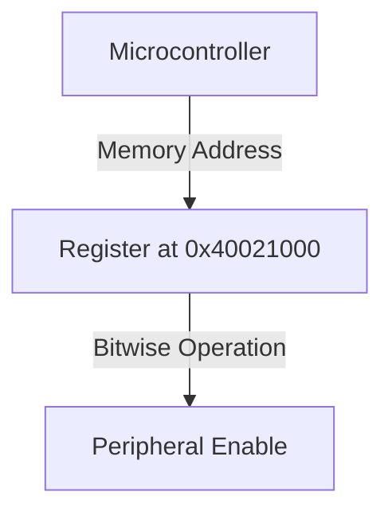

```markdown
# Use of * and & in C Pointers

## Introduction
In C programming, the asterisk (`*`) and ampersand (`&`) are fundamental operators for working with pointers. They allow efficient memory management and direct access to hardware in embedded systems.

## Understanding `&` (Address-of Operator)
The `&` operator retrieves the memory address of a variable.

```c
int num = 10;
int *ptr = &num; // &num gets the address of num
printf("Address of num: %p", ptr);
```

### Memory Representation


## Understanding `*` (Pointer Declaration and Dereferencing)
The `*` operator has two roles:
1. **Declaring a pointer**: It signifies that a variable is a pointer.
2. **Dereferencing a pointer**: It retrieves the value stored at the pointer’s memory address.

```c
int num = 10;
int *ptr = &num; // Pointer declaration
printf("Value of num: %d", *ptr); // Dereferencing
```

### Pointer Dereferencing Representation
```mermaid
graph TD
    A[Pointer ptr] -->|Dereference (*)| B[Value of num]
```

## Combining `&` and `*`
Using both operators together returns the original value.

```c
int num = 10;
int *ptr = &num;
printf("Original Value: %d", *(&num));
```

## Pointers to Pointers (`**`)
A pointer can store the address of another pointer.

```c
int num = 10;
int *ptr = &num;
int **ptr2 = &ptr;
printf("Value using ptr2: %d", **ptr2);
```

### Double Pointer Representation
```mermaid
graph TD
    A[Variable num] -->|&num| B[Pointer ptr]
    B -->|&ptr| C[Double Pointer ptr2]
    C -->|Dereference (**)| A
```

## Application in Embedded Systems
Pointers are used for direct memory access in embedded systems.

```c
#define REG_ADDR (*(volatile unsigned int*) 0x40021000)

void enablePeripheral() {
    REG_ADDR |= (1 << 3); // Set a specific bit
}
```

### Embedded Memory Mapping


Understanding `*` and `&` enables efficient low-level programming and memory manipulation in C.
```
