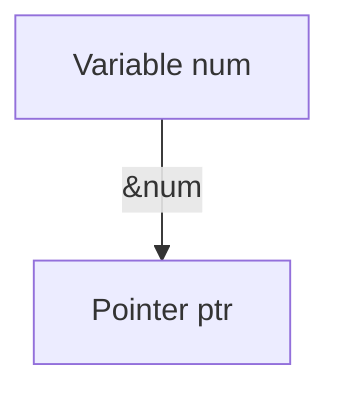
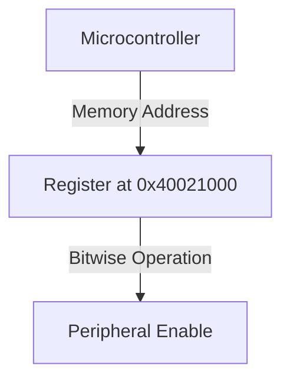

```markdown
# Declaring/Defining a Pointer in C

## Introduction
A pointer in C is a variable that stores the memory address of another variable. Proper declaration and definition of pointers are crucial for efficient memory management and low-level programming, especially in embedded systems.

## Pointer Declaration
To declare a pointer, use the asterisk (`*`) symbol before the pointer variable name.

```c
int *ptr;
```
This statement declares `ptr` as a pointer to an integer (`int`).

### Syntax Breakdown
```c
<data_type> *<pointer_name>;
```
- `data_type`: The type of data the pointer will point to (e.g., `int`, `char`, `float`).
- `*`: Indicates that the variable is a pointer.
- `pointer_name`: The name of the pointer variable.

## Pointer Definition and Initialization
A pointer is assigned a memory address using the address-of (`&`) operator.

```c
int num = 10;
int *ptr = &num; // ptr now stores the address of num
```

### Memory Representation


## Pointer Dereferencing
To access the value stored at the memory location, use the `*` operator.

```c
printf("Value of num: %d", *ptr);
```

### Dereferencing Representation
```mermaid
graph TD
    A[Pointer ptr] -->|Dereference (*)| B[Value of num]
```

## Declaring Multiple Pointers
Multiple pointers can be declared in a single statement.

```c
int *ptr1, *ptr2;
```

Each pointer must be preceded by `*` to indicate that it is a pointer.

## Pointers to Pointers
A pointer can store the address of another pointer.

```c
int **ptr2 = &ptr;
```

### Double Pointer Representation
```mermaid
graph TD
    A[Variable num] -->|&num| B[Pointer ptr]
    B -->|&ptr| C[Double Pointer ptr2]
    C -->|Dereference (**)| A
```

## Application in Embedded Systems
Pointers are commonly used for direct memory access in embedded C.

```c
#define REG_ADDR (*(volatile unsigned int*) 0x40021000)

void enablePeripheral() {
    REG_ADDR |= (1 << 3); // Set a specific bit
}
```

### Embedded Memory Mapping


Understanding pointer declaration and definition is essential for effective low-level programming.
```
