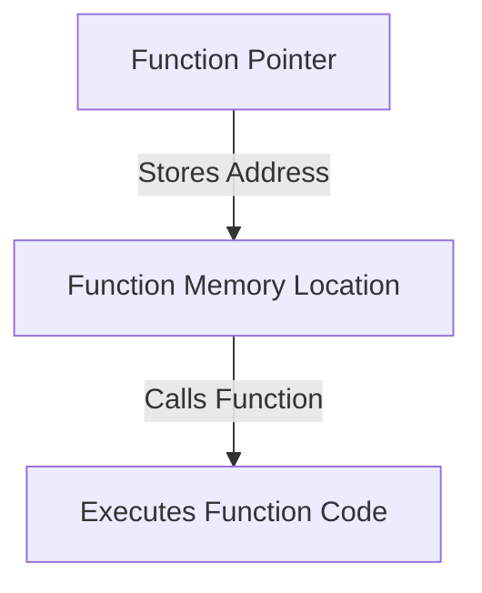

```markdown
# Function Pointers in C

## Overview
A **function pointer** is a pointer that stores the address of a function and allows for function calls through the pointer. This enables dynamic function execution, callback functions, and efficient memory utilization.

## Table of Contents
1. [What is a Function Pointer?](#what-is-a-function-pointer)
2. [Declaring a Function Pointer](#declaring-a-function-pointer)
3. [Assigning a Function to a Pointer](#assigning-a-function-to-a-pointer)
4. [Calling a Function via Pointer](#calling-a-function-via-pointer)
5. [Example Code](#example-code)
6. [Function Pointer in Arrays](#function-pointer-in-arrays)
7. [Function Pointer as Callback](#function-pointer-as-callback)
8. [Mermaid Diagram](#mermaid-diagram)
9. [Use Cases](#use-cases)
10. [Conclusion](#conclusion)

## What is a Function Pointer?
A function pointer holds the **memory address of a function**. This allows a function to be called indirectly through a pointer.

```c
void (*funcPtr)(); // Declaration of a function pointer
```

## Declaring a Function Pointer
A function pointer declaration follows this format:
```c
data_type (*pointer_name)(parameter_list);
```
### Example:
```c
int (*ptrFunc)(int, int);
```
This declares a function pointer `ptrFunc` that points to a function returning `int` and taking two `int` parameters.

## Assigning a Function to a Pointer
A function’s address is assigned to a function pointer without using `&` (optional).
```c
int add(int a, int b) {
    return a + b;
}
int (*ptrFunc)(int, int) = add;
```

## Calling a Function via Pointer
A function pointer can be used to call the assigned function.
```c
int result = ptrFunc(5, 10); // Calls add(5, 10)
printf("Result: %d", result);
```

## Example Code
```c
#include <stdio.h>

int add(int a, int b) {
    return a + b;
}

int main() {
    int (*ptrFunc)(int, int) = add;
    printf("Sum: %d\n", ptrFunc(10, 20));
    return 0;
}
```
### Output:
```
Sum: 30
```

## Function Pointer in Arrays
Function pointers can be stored in arrays to call different functions dynamically.
```c
int multiply(int a, int b) { return a * b; }
int divide(int a, int b) { return a / b; }

int (*operations[2])(int, int) = {multiply, divide};
int result = operations[0](6, 3); // Calls multiply(6, 3)
```

## Function Pointer as Callback
Function pointers are used as **callbacks** in event-driven programming.
```c
void greet() {
    printf("Hello!\n");
}
void execute(void (*func)()) {
    func();
}
int main() {
    execute(greet);
    return 0;
}
```

## Mermaid Diagram


## Use Cases
1. **Callback Functions** – Used in event-driven systems.
2. **Dynamic Function Calls** – Select functions at runtime.
3. **Efficient Memory Usage** – Avoids redundant function calls.
4. **State Machines** – Used in embedded systems.

## Conclusion
- **Function pointers store addresses of functions.**
- **Used for callbacks, function arrays, and dynamic execution.**
- **Enhances flexibility in C programming.**
```
