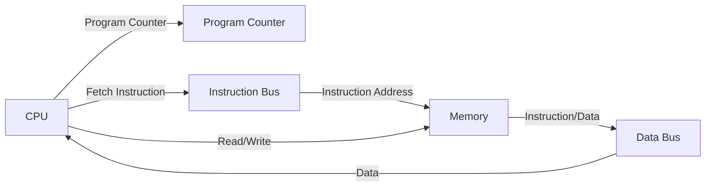
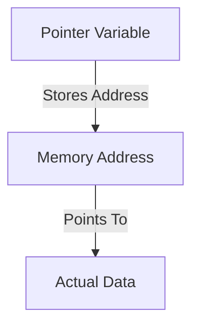
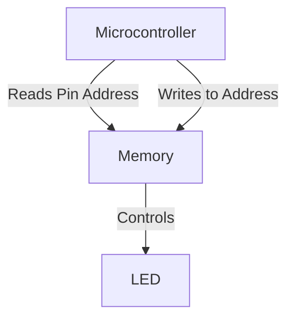

# Understanding C - Pointers

## What to Imagine
Understanding pointers in C requires visualizing how memory interacts with the CPU. Memory is arranged in a structured manner, and the CPU accesses it using different buses:

- **Program Counter (PC)**: Tracks the instruction address.
- **Instruction Bus**: Transfers instructions and their addresses.
- **Data Bus**: Moves data and its corresponding addresses.
- **Read/Write Operations**: Allow the CPU to fetch or store data.
- **Memory Arrangement**: Data is stored in bits and bytes, with each byte having a unique address.

### Memory and CPU Interaction


### How Many Bytes Move In and Out?
The number of bytes transferred depends on:
- CPU architecture (8-bit, 16-bit, 32-bit, or 64-bit).
- Data type size (char = 1 byte, int = 2 or 4 bytes, float = 4 bytes, etc.).
- Memory addressing and alignment constraints.

## What is a Pointer?
A **pointer** is a number representing a memory address. This address can be 0 or any positive integer corresponding to the location of a byte in memory.

### The Book Analogy
Imagine reading a book:
- You start on **page 1** (memory location 0x0001).
- Instead of reading sequentially, you jump to **page 20** (0x0014 in hex).
- The number "20" represents an address pointing to the content.

Similarly, in memory:
- The **book** is the memory.
- The **page number** is the address.
- The **CPU** is the person reading.

### Memory Representation of a Pointer


## Why Use C Pointers?
Pointers are crucial in C programming, especially in embedded systems, for:
1. **Efficient Memory Access** - Directly accessing memory locations reduces overhead.
2. **Hardware Interaction** - Used for configuring registers in microcontrollers.
3. **Dynamic Memory Management** - Allocating and freeing memory in real-time systems.

### Practical Example: Controlling an LED
In embedded systems, controlling an LED with pointers:
```c
#define LED_PIN (*(volatile unsigned char*) 0x25) // Assume 0x25 is the LED memory-mapped address

void turnOnLED() {
    LED_PIN = 1; // Write to memory location
}
```

### Memory-Mapped Circuit Interaction


Pointers enable direct hardware access, making them essential in embedded programming.
