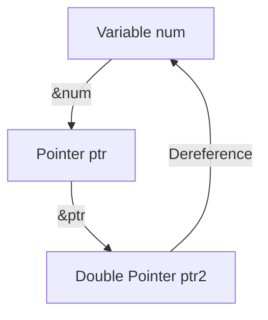
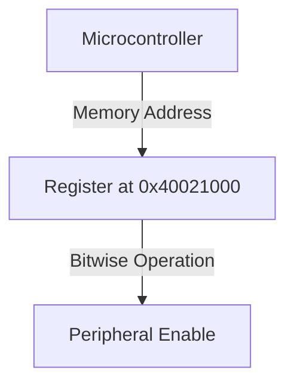

```markdown
# Many *S and Many &S

## Understanding the Asterisk (*) and Ampersand (&) in C Pointers
In C programming, the asterisk (`*`) and ampersand (`&`) are fundamental operators used with pointers. Understanding how they work is crucial for handling memory addresses and data manipulation efficiently.

### The Asterisk (`*`): Pointer Declaration and Dereferencing
The `*` operator serves two primary roles:
1. **Declaring a Pointer**: It tells the compiler that a variable is a pointer.
2. **Dereferencing a Pointer**: It retrieves the value stored at a given memory address.

```c
int num = 10;
int *ptr = &num; // Declaring a pointer and assigning the address of num
printf("Value of num: %d", *ptr); // Dereferencing the pointer to get num's value
```

### The Ampersand (`&`): Address-of Operator
The `&` operator retrieves the memory address of a variable. It is commonly used to assign addresses to pointers.

```c
int num = 10;
int *ptr = &num; // &num gets the memory address of num
printf("Address of num: %p", ptr); // Prints the address stored in ptr
```

### Multiple Asterisks (`**`, `***`): Pointers to Pointers
A pointer can also store the address of another pointer, forming multiple levels of indirection.

```c
int num = 10;
int *ptr = &num;
int **ptr2 = &ptr;
printf("Value of num using ptr2: %d", **ptr2); // Double dereference
```

### Pointer Diagram Representation


### Practical Usage: Pointer Manipulation in Embedded Systems
Pointers are extensively used in embedded C programming for direct memory manipulation.
```c
#define REG_ADDR (*(volatile unsigned int*) 0x40021000)

void enablePeripheral() {
    REG_ADDR |= (1 << 3); // Set a specific bit
}
```

This approach is used for directly accessing memory-mapped registers in microcontrollers.



Using multiple `*` and `&` operations allows for efficient memory and hardware manipulation in low-level C programming.
```
