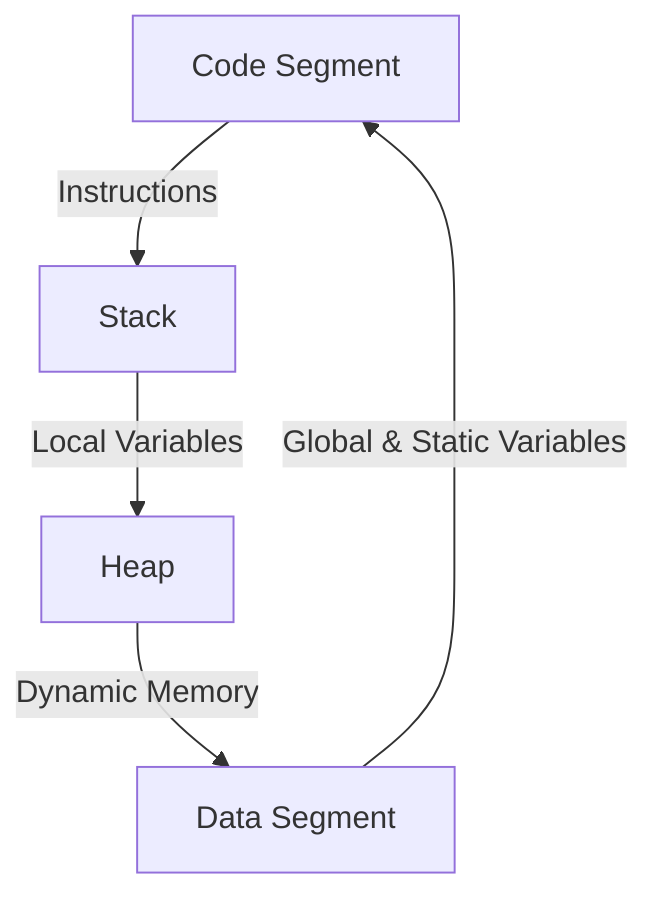

```markdown
# Memory Model and Pointer to Data in C

## Overview
Understanding the memory model is crucial for working with **pointers** in C. Pointers provide direct access to memory addresses, enabling efficient manipulation of data.

## Table of Contents
1. [Understanding the Memory Model](#understanding-the-memory-model)
2. [Pointer to Data](#pointer-to-data)
3. [Memory Layout](#memory-layout)
4. [Example Code](#example-code)
5. [Pointer Dereferencing](#pointer-dereferencing)
6. [Dynamic Memory Allocation](#dynamic-memory-allocation)
7. [Pointer Arithmetic](#pointer-arithmetic)
8. [Use Cases](#use-cases)
9. [Mermaid Diagrams](#mermaid-diagrams)

## Understanding the Memory Model
A typical C program is divided into **four main memory segments**:
1. **Code Segment** – Stores executable instructions.
2. **Stack** – Stores local variables and function call data.
3. **Heap** – Stores dynamically allocated memory.
4. **Data Segment** – Stores global and static variables.

### Memory Segments


## Pointer to Data
A **pointer to data** stores the address of a variable in memory.
```c
int num = 42;
int *ptr = &num;
```
- `&num` gets the address of `num`.
- `ptr` stores the address of `num`.
- `*ptr` accesses the value stored at that address.

## Memory Layout
A pointer holds an address, while a variable holds a value.

```mermaid
graph TD
    A[Variable num (42)] -->|Stored at Address 0x100| B[Pointer ptr (0x100)]
```

## Example Code
```c
#include <stdio.h>

int main() {
    int num = 100;
    int *ptr = &num;

    printf("Address of num: %p\n", &num);
    printf("Pointer stores address: %p\n", ptr);
    printf("Value at pointer address: %d\n", *ptr);

    return 0;
}
```
### Output:
```
Address of num: 0x7ffee2b5c804
Pointer stores address: 0x7ffee2b5c804
Value at pointer address: 100
```

## Pointer Dereferencing
Accessing the value stored at a pointer’s memory location is called **dereferencing**.
```c
int x = 5;
int *ptr = &x;
printf("Value using pointer: %d", *ptr);
```

## Dynamic Memory Allocation
The **heap** stores dynamically allocated memory using `malloc()` and `free()`.
```c
int *ptr = (int *)malloc(sizeof(int));
*ptr = 25;
printf("Dynamically allocated value: %d", *ptr);
free(ptr);
```

## Pointer Arithmetic
Pointer arithmetic is used to traverse memory locations.
```c
int arr[] = {10, 20, 30};
int *ptr = arr;
ptr++;
printf("Next value: %d", *ptr);
```

## Use Cases
1. **Efficient Memory Access** – Used in system programming.
2. **Dynamic Memory Management** – Required for managing heap memory.
3. **Function Arguments** – Used to modify values via references.
4. **Data Structures** – Enables linked lists, trees, and other structures.

## Mermaid Diagrams
```mermaid
graph TD
    A[Variable num (42)] -->|Address: 0x100| B[Pointer ptr (0x100)]
```

## Conclusion
- **Pointers store memory addresses.**
- **Memory models include stack, heap, and data segments.**
- **Dereferencing and pointer arithmetic enable efficient memory handling.**
```
