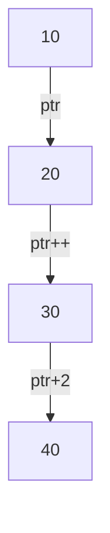

```markdown
# Pointer Arithmetic in C

## Overview
Pointer arithmetic in C allows manipulation of memory addresses. Since pointers store addresses, arithmetic operations can be performed on them to navigate through memory.

## Table of Contents
1. [What is Pointer Arithmetic?](#what-is-pointer-arithmetic)
2. [Types of Pointer Arithmetic](#types-of-pointer-arithmetic)
3. [Example Code](#example-code)
4. [Memory Layout](#memory-layout)
5. [Pointer Incrementation](#pointer-incrementation)
6. [Pointer Subtraction](#pointer-subtraction)
7. [Comparison of Pointers](#comparison-of-pointers)
8. [Use Cases](#use-cases)
9. [Mermaid Diagrams](#mermaid-diagrams)

## What is Pointer Arithmetic?
Pointer arithmetic involves performing operations like **addition, subtraction, and comparison** on pointers to access different memory locations efficiently.

## Types of Pointer Arithmetic
### 1. Incrementing a Pointer
Moves the pointer to the next memory location based on the datatype size.
```c
int *ptr;
ptr++; // Moves forward by sizeof(int) bytes
```

### 2. Decrementing a Pointer
Moves the pointer to the previous memory location.
```c
ptr--; // Moves backward by sizeof(int) bytes
```

### 3. Pointer Addition
Adds an integer to a pointer.
```c
ptr = ptr + 2; // Moves forward by 2 * sizeof(int)
```

### 4. Pointer Subtraction
Finds the difference between two pointers.
```c
int diff = ptr2 - ptr1; // Returns number of elements between ptr1 and ptr2
```

## Example Code
```c
#include <stdio.h>

int main() {
    int arr[] = {10, 20, 30, 40, 50};
    int *ptr = arr;
    
    printf("Current value: %d\n", *ptr);
    ptr++;
    printf("Next value: %d\n", *ptr);
    ptr += 2;
    printf("Skipping to value: %d\n", *ptr);
    
    return 0;
}
```
### Output:
```
Current value: 10
Next value: 20
Skipping to value: 40
```

## Memory Layout
Pointer arithmetic follows the memory structure of arrays.



## Pointer Incrementation
A pointer moves by the **size of its datatype**.
```c
ptr++;
```
For an `int` (4 bytes), `ptr++` moves forward by 4 bytes.

## Pointer Subtraction
Subtracting two pointers gives the **number of elements** between them.
```c
int diff = ptr2 - ptr1;
printf("Elements between: %d", diff);
```

## Comparison of Pointers
Pointers can be compared using relational operators.
```c
if (ptr1 > ptr2) {
    printf("ptr1 is ahead");
}
```

## Use Cases
### 1. Iterating Through Arrays
Pointer arithmetic efficiently iterates through arrays.
```c
for (int *ptr = arr; ptr < arr + 5; ptr++) {
    printf("%d ", *ptr);
}
```

### 2. Dynamic Memory Allocation
Used with `malloc()` and `calloc()`.

### 3. String Manipulation
Used for handling character arrays and strings.

## Mermaid Diagrams

### Pointer Arithmetic Representation


## Conclusion
- **Pointer arithmetic** allows efficient memory access.
- Operations depend on the **size of the datatype**.
- Used in **array traversal, dynamic memory allocation, and string handling**.
```
