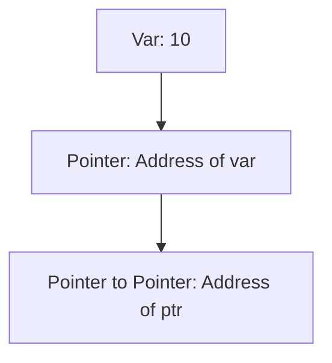
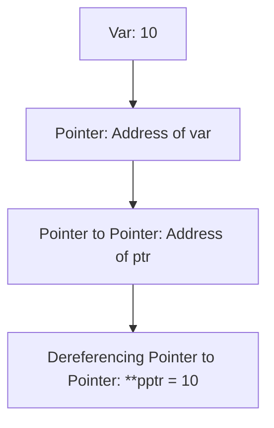

# Pointer to Pointer in C

## Overview
A **Pointer to Pointer** in C is a pointer that stores the address of another pointer. It allows multi-level pointer dereferencing and is useful for handling complex data structures, dynamic memory, and modifying pointer values in functions.

## Table of Contents
1. [What is a Pointer to Pointer?](#what-is-a-pointer-to-pointer)
2. [Syntax and Declaration](#syntax-and-declaration)
3. [Example Code](#example-code)
4. [Memory Layout](#memory-layout)
5. [Dereferencing Pointers](#dereferencing-pointers)
6. [Use Cases](#use-cases)
7. [Mermaid Diagrams](#mermaid-diagrams)

## What is a Pointer to Pointer?
A **pointer to pointer** is a variable that stores the address of another pointer, enabling multiple levels of indirection.

### Syntax
```c
int **ptr;
```
- `int **ptr;` declares a pointer to a pointer that stores the address of an integer pointer.

### Example
```c
int var = 10;
int *ptr = &var;
int **pptr = &ptr;
```
- `var` is an integer.
- `ptr` is a pointer to `var`.
- `pptr` is a pointer to `ptr`.

## Syntax and Declaration
```c
int *ptr;  // Pointer to an integer
int **pptr;  // Pointer to a pointer
int var = 10;
ptr = &var;
pptr = &ptr;
```

## Example Code
```c
#include <stdio.h>

int main() {
    int var = 10;        // Integer variable
    int *ptr = &var;     // Pointer to var
    int **pptr = &ptr;   // Pointer to pointer

    printf("Value of var using ptr: %d\n", *ptr);
    printf("Value of var using pptr: %d\n", **pptr);

    return 0;
}
```
### Output:
```
Value of var using ptr: 10
Value of var using pptr: 10
```

## Memory Layout
Understanding memory allocation helps visualize pointer relationships.



## Dereferencing Pointers
### Dereferencing Pointer (`*ptr`)
```c
printf("Value of var using ptr: %d\n", *ptr);
```
### Dereferencing Pointer to Pointer (`**pptr`)
```c
printf("Value of var using pptr: %d\n", **pptr);
```

## Use Cases
### 1. Multi-dimensional Arrays
Used for managing multi-dimensional arrays dynamically.

### 2. Dynamic Memory Allocation
Used when handling dynamically allocated memory structures.

### 3. Passing Pointers to Functions
Allows modifying the original pointer in functions.

#### Example:
```c
void modifyPointer(int **ptr) {
    static int newVar = 20;
    *ptr = &newVar; // Modify pointer value
}

int main() {
    int *ptr = NULL;
    modifyPointer(&ptr);
    printf("New value: %d\n", *ptr);
    return 0;
}
```
### Output:
```
New value: 20
```

## Mermaid Diagrams

### Pointer to Pointer Representation


## Conclusion
- **Pointer to Pointer** enables multiple levels of indirection.
- Used in **dynamic memory allocation**, **passing pointers to functions**, and **multi-dimensional arrays**.
- **Dereferencing** requires multiple `*` operators based on levels.
