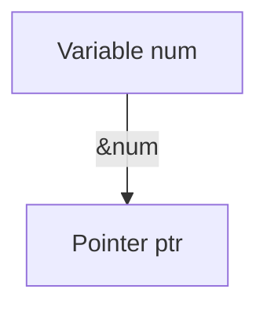
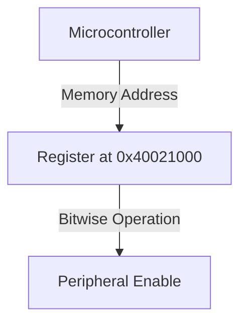

```markdown
# Pointer Variable and Address in C

## Introduction
A **pointer variable** is a variable that stores the memory address of another variable. This allows direct memory access, which is crucial for efficient low-level programming in embedded systems.

## Understanding Pointer Variables
A pointer variable holds the address of another variable. It is declared using the `*` symbol.

```c
int num = 10;
int *ptr = &num; // Pointer variable storing the address of num
```

### Memory Representation


## Memory Address of a Variable
Each variable in memory has a unique address that can be retrieved using the `&` (address-of) operator.

```c
printf("Address of num: %p", &num);
```

## Pointer Variable Initialization
A pointer variable must be initialized with the address of a valid variable before dereferencing.

```c
int num = 10;
int *ptr = &num;
printf("Pointer Address: %p", ptr);
printf("Value at Address: %d", *ptr);
```

### Pointer Address and Dereferencing
```mermaid
graph TD
    A[Variable num] -->|&num| B[Pointer ptr]
    B -->|Dereference (*)| C[Value of num]
```

## Pointers to Pointers (Double Pointers)
A pointer can store the address of another pointer, forming a multi-level pointer system.

```c
int **ptr2 = &ptr;
printf("Value using ptr2: %d", **ptr2);
```

### Double Pointer Representation
```mermaid
graph TD
    A[Variable num] -->|&num| B[Pointer ptr]
    B -->|&ptr| C[Double Pointer ptr2]
    C -->|Dereference (**)| A
```

## Application in Embedded Systems
Pointers are widely used in embedded systems for direct memory access.

```c
#define REG_ADDR (*(volatile unsigned int*) 0x40021000)

void enablePeripheral() {
    REG_ADDR |= (1 << 3); // Enable a specific peripheral
}
```

### Embedded Memory Mapping


Understanding pointer variables and addresses is essential for efficient memory management and system programming in C.
```
