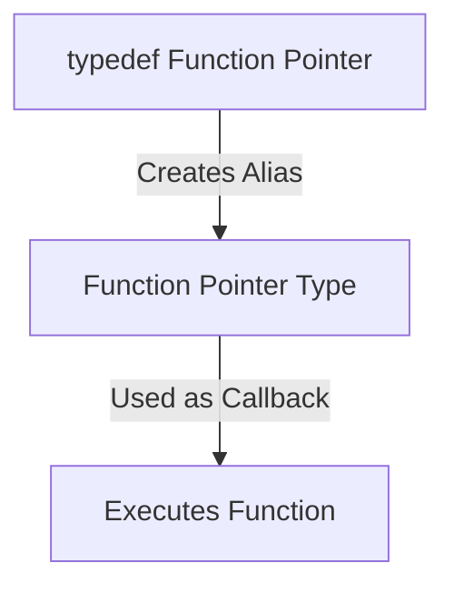

```markdown
# typedef and Function Pointers in C

## Overview
The `typedef` keyword in C is used to define custom data types, including function pointers. It simplifies complex function pointer declarations and enhances code readability.

## Table of Contents
1. [Understanding typedef](#understanding-typedef)
2. [Syntax of typedef](#syntax-of-typedef)
3. [Function Pointers](#function-pointers)
4. [Using typedef with Function Pointers](#using-typedef-with-function-pointers)
5. [Example Code](#example-code)
6. [Function Pointer as Callback with typedef](#function-pointer-as-callback-with-typedef)
7. [Mermaid Diagram](#mermaid-diagram)
8. [Use Cases](#use-cases)
9. [Conclusion](#conclusion)

## Understanding typedef
The `typedef` keyword creates an alias for an existing data type, making the code easier to read and maintain.

### Example:
```c
typedef unsigned int uint;
uint age = 25; // Equivalent to 'unsigned int age = 25;'
```

## Syntax of typedef
```c
typedef existing_type new_name;
```

## Function Pointers
A function pointer stores the memory address of a function and allows indirect function calls.

### Example:
```c
int add(int a, int b) {
    return a + b;
}
int (*ptrFunc)(int, int) = add;
```

## Using typedef with Function Pointers
Using `typedef` with function pointers improves readability by defining an alias for the function pointer type.

### Without typedef:
```c
int (*ptrFunc)(int, int);
```

### With typedef:
```c
typedef int (*FuncPtr)(int, int);
FuncPtr ptrFunc;
```

## Example Code
```c
#include <stdio.h>

typedef int (*FuncPtr)(int, int);

int multiply(int a, int b) {
    return a * b;
}

int main() {
    FuncPtr ptr = multiply;
    printf("Product: %d\n", ptr(4, 5));
    return 0;
}
```
### Output:
```
Product: 20
```

## Function Pointer as Callback with typedef
Function pointers are commonly used as **callbacks** in C.
```c
#include <stdio.h>

typedef void (*Callback)(void);

void sayHello() {
    printf("Hello, World!\n");
}

void executeCallback(Callback func) {
    func();
}

int main() {
    executeCallback(sayHello);
    return 0;
}
```

## Mermaid Diagram


## Use Cases
1. **Simplifies Function Pointer Declarations** – Improves readability.
2. **Callback Functions** – Used in event-driven programming.
3. **State Machines** – Useful in embedded systems.
4. **Dynamic Function Execution** – Enhances modularity.

## Conclusion
- **typedef creates an alias for function pointers.**
- **Improves readability and simplifies complex declarations.**
- **Widely used in callbacks, state machines, and modular programming.**
```
