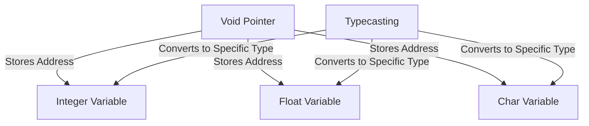

```markdown
# Understanding Void Pointers in C

## Overview
A **void pointer** (also known as a generic pointer) in C is a pointer that has no associated data type. It can hold the address of any data type but cannot be dereferenced directly.

## Table of Contents
1. [What is a Void Pointer?](#what-is-a-void-pointer)
2. [Declaring and Using Void Pointers](#declaring-and-using-void-pointers)
3. [Why Can't You Dereference a Void Pointer?](#why-cant-you-dereference-a-void-pointer)
4. [Typecasting a Void Pointer](#typecasting-a-void-pointer)
5. [Practical Example](#practical-example)
6. [Mermaid Diagram](#mermaid-diagram)
7. [Use Cases of Void Pointers](#use-cases-of-void-pointers)
8. [Conclusion](#conclusion)

## What is a Void Pointer?
A **void pointer** is a special type of pointer that does not have an associated data type. It can store the address of any variable, but it cannot be dereferenced directly without typecasting.

### Example:
```c
int i = 10;
void *pi = &i;  // Void pointer holding the address of an integer
```

## Declaring and Using Void Pointers
```c
#include <stdio.h>

int main() {
    int i = 10;
    void *pi = &i;  // Void pointer storing the address of 'i'

    printf("pi: %p, &i: %p\n", pi, &i);
    return 0;
}
```
### Output:
```
pi: 0x7ffdf5a7eac0, &i: 0x7ffdf5a7eac0
```

## Why Can't You Dereference a Void Pointer?
A void pointer does not have a specific data type. When you try to dereference `*pi`, the compiler does not know how many bytes to read.

### Example:
```c
// Uncomment the following line to see the error
// printf("*pi: %d\n", *pi);
```
This results in a **compilation error** because the compiler does not know how many bytes to fetch for `*pi`.

## Typecasting a Void Pointer
To use a void pointer properly, it must be **typecast** to the correct data type.

```c
#include <stdio.h>

int main() {
    int i = 10;
    void *pi = &i;

    printf("pi: %p, &i: %p\n", pi, &i);
    printf("*pi after typecasting: %d\n", *((int*)pi));

    return 0;
}
```
### Output:
```
pi: 0x7ffdf5a7eac0, &i: 0x7ffdf5a7eac0
*pi after typecasting: 10
```

## Practical Example
Void pointers are useful in scenarios where a function needs to handle different data types dynamically.

### Example: Generic Function Using Void Pointer
```c
#include <stdio.h>
void printValue(void *ptr, char type) {
    switch (type) {
        case 'i': printf("Integer: %d\n", *((int*)ptr)); break;
        case 'f': printf("Float: %f\n", *((float*)ptr)); break;
        case 'c': printf("Character: %c\n", *((char*)ptr)); break;
    }
}

int main() {
    int i = 42;
    float f = 3.14;
    char c = 'A';

    printValue(&i, 'i');
    printValue(&f, 'f');
    printValue(&c, 'c');

    return 0;
}
```
### Output:
```
Integer: 42
Float: 3.140000
Character: A
```

## Mermaid Diagram


## Use Cases of Void Pointers
1. **Dynamic Memory Allocation** – `malloc()` and `calloc()` return void pointers.
2. **Generic Data Handling** – Used in libraries like `qsort()`.
3. **Function Parameters** – Allows passing data of any type to functions.
4. **Interfacing with Hardware** – Useful in low-level programming.

## Conclusion
- **A void pointer stores an address but lacks a data type.**
- **Dereferencing a void pointer requires explicit typecasting.**
- **Useful for dynamic memory, generic functions, and low-level programming.**
```
